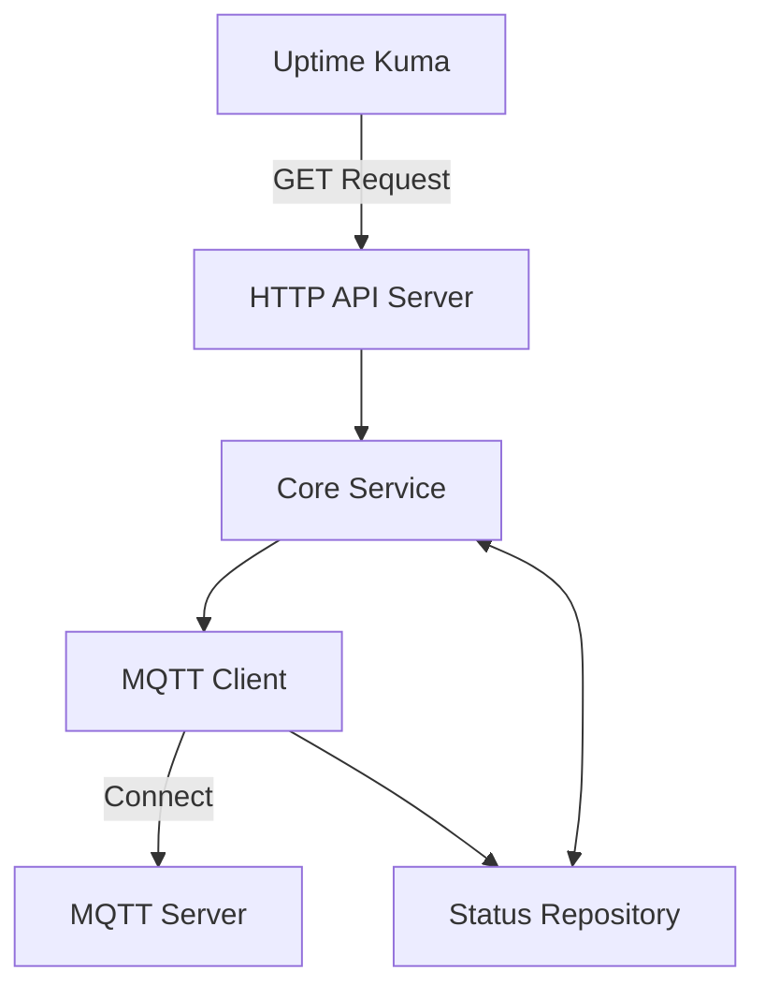

# Design Document: MQTT Monitoring for Alert System

## Overview

The Alert system extends Uptime Kuma's monitoring capabilities by providing
specialized monitoring for MQTT servers. This design document outlines the
architecture and components needed to implement an MQTT client that monitors
server status and latency, exposing this information through an API that Uptime
Kuma can query.

The system is designed to be lightweight and focused on the core MQTT monitoring
functionality while maintaining an architecture that can be extended to support
additional Uptime Kuma features in the future.

## Architecture

The Alert system follows a modular architecture with clear separation of
concerns:



### Components:

1. **HTTP API Server**: Handles incoming requests from Uptime Kuma and returns
   MQTT status information.
2. **Core Service**: Manages the application's business logic and coordinates
   between components.
3. **MQTT Client**: Connects to the MQTT server, monitors connection status, and
   measures latency.
4. **Status Repository**: Stores and manages MQTT connection status and metrics.

## Components and Interfaces

### HTTP API Server

The HTTP API server will provide endpoints for Uptime Kuma to query MQTT server
status.

**Endpoints:**

- `GET /mqtt/status`: Returns the current status of the MQTT server connection.

**Response Format:**

```json
{
  "connected": boolean,
  "latency": number,  // in milliseconds
  "lastConnected": string,  // ISO timestamp
  "lastDisconnected": string  // ISO timestamp (null if currently connected)
}
```

### Core Service

The Core Service acts as the central coordinator for the application:

- Initializes and manages the MQTT client
- Processes status updates from the MQTT client
- Provides status information to the HTTP API server

**Interface:**

```typescript
interface CoreService {
  initialize(): Promise<void>;
  getMqttStatus(): MqttStatus;
  shutdown(): Promise<void>;
}
```

### MQTT Client

The MQTT Client handles the connection to the MQTT server and monitors its
status:

- Establishes and maintains connection to the MQTT server
- Measures connection latency using ping/pong mechanism
- Reports connection status changes to the Core Service

**Interface:**

```typescript
interface MqttClient {
  connect(config: MqttConfig): Promise<void>;
  disconnect(): Promise<void>;
  isConnected(): boolean;
  getLatency(): number;
  onStatusChange(callback: (status: MqttStatus) => void): void;
}
```

### Status Repository

The Status Repository stores the MQTT connection status and metrics:

- Records connection and disconnection events
- Stores latency measurements
- Provides current and historical status information

**Interface:**

```typescript
interface StatusRepository {
  updateStatus(status: MqttStatus): void;
  getCurrentStatus(): MqttStatus;
}
```

## Data Models

The system will use minimal data structures focused on the requirements:

### MqttConfig

```typescript
interface MqttConfig {
  url: string;
  port: number;
  username?: string;
  password?: string;
  clientId: string;
  keepAlive?: number;
}
```

### MqttStatus

```typescript
interface MqttStatus {
  connected: boolean;
  latency: number; // in milliseconds
  lastConnected: string | null; // ISO timestamp
  lastDisconnected: string | null; // ISO timestamp
}
```

## Error Handling

The system will implement the following error handling strategies:

1. **Connection Failures**: The MQTT client will implement automatic
   reconnection with exponential backoff.
2. **API Errors**: The HTTP API will return appropriate status codes and error
   messages.
3. **Logging**: All errors will be logged with appropriate severity levels.

**Error Response Format:**

```json
{
  "error": true,
  "message": "Error description",
  "code": "ERROR_CODE"
}
```

## Testing Strategy

The testing strategy will focus on ensuring the reliability of the MQTT
monitoring functionality:

1. **Unit Tests**: Test individual components in isolation with mocked
   dependencies.
2. **Integration Tests**: Test the interaction between components.
3. **End-to-End Tests**: Test the complete flow from HTTP request to MQTT status
   response.

Key test scenarios:

- MQTT connection establishment and monitoring
- Latency measurement accuracy
- Connection loss and recovery handling
- API response correctness

Each test will focus on verifying a specific aspect of the system's
functionality, with minimal test cases that provide adequate coverage of the
core functionality.
